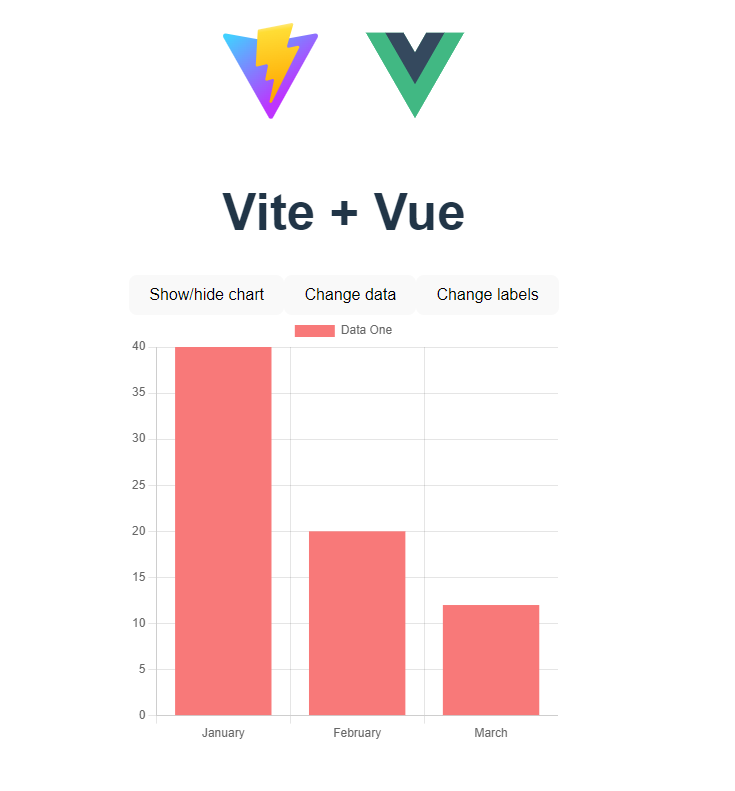

# tutorials-vue-chartjs-getting-started
This is a vue.js single-page application that uses vue-chartjs. The steps from getting started guide were followed.

### Screenshot

### Built with
- Vue.js - Vue 3 - a progressive framework for building user interfaces
- TypeScript
- Vite
- vue-chartjs library

The Vue 3 + TypeScript + Vite template was used.
### Vue 3 + TypeScript + Vite

This template should help get you started developing with Vue 3 and TypeScript in Vite. The template uses Vue 3 `<script setup>` SFCs, check out the [script setup docs](https://v3.vuejs.org/api/sfc-script-setup.html#sfc-script-setup) to learn more.

#### Recommended IDE Setup

- [VS Code](https://code.visualstudio.com/) + [Volar](https://marketplace.visualstudio.com/items?itemName=Vue.volar)

#### Type Support For `.vue` Imports in TS

Since TypeScript cannot handle type information for `.vue` imports, they are shimmed to be a generic Vue component type by default. In most cases this is fine if you don't really care about component prop types outside of templates. However, if you wish to get actual prop types in `.vue` imports (for example to get props validation when using manual `h(...)` calls), you can enable Volar's Take Over mode by following these steps:

1. Run `Extensions: Show Built-in Extensions` from VS Code's command palette, look for `TypeScript and JavaScript Language Features`, then right click and select `Disable (Workspace)`. By default, Take Over mode will enable itself if the default TypeScript extension is disabled.
2. Reload the VS Code window by running `Developer: Reload Window` from the command palette.

You can learn more about Take Over mode [here](https://github.com/johnsoncodehk/volar/discussions/471).

## Author

- LinkedIn - [Karlo Siladi](https://www.linkedin.com/in/karlosiladi/)
- Frontend Mentor - [@siladikarlo856](https://www.frontendmentor.io/profile/siladikarlo856)
- CodePen - [@developersiladi](https://codepen.io/developersiladi/)
- freeCodeCamp - [@developersiladi](https://www.freecodecamp.org/developersiladi)

## Acknowledgments
- [Fullstack Vue3](https://www.newline.co/vue) - The Complete Guide to Vue.js by Hassan Djirdeh
- MDN Web Docs
- [vue-chartjs](https://vue-chartjs.org/) - Easy and beautiful charts with Chart.js and Vue.js